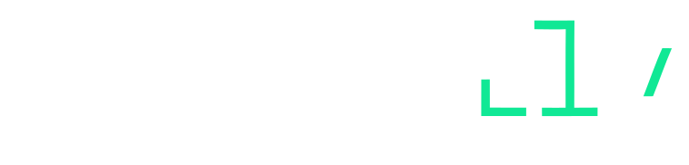

---

The open-source CVE catalog, pipeline, and MCP server behind [aigent.ly](https://aigent.ly). Every day, CI ingests fresh CVEs from five public threat sources, enriches them with AI-generated coding patterns, and commits ready-to-use security rules directly into this repo — formatted for Cursor, Claude Code, Windsurf, GitHub Copilot, and Cline.

> "We open-sourced everything the community needs — the data, the pipeline, the stack registry.
> The web app that runs aigent.ly is private. Because a security product should practice what it preaches."

---

## How it works

[](https://asciinema.org/a/hvKBCjRDdgQVEZQH)

```text
CVE published  →  pipeline detects it  →  Claude generates safe-code patterns
    →  rule committed to this repo  →  your IDE enforces it while you type
```

AI coding assistants write production code fast. They don't know which CVEs affect your stack today, or how to write around them. Aigent.ly bridges that gap: it turns a live CVE feed into IDE rules that travel with your project, enforced at generation time — not discovered at audit time.

---

## Repository layout

| Path | Contents |
| --- | --- |
| `packages/catalog-data/` | Live threat snapshots — JSON committed daily by CI |
| `packages/mcp-server/` | MCP server (`@aigently/mcp-server`) — exposes catalog to AI agents |
| `packages/db/` | Drizzle schema shared between the pipeline and the web app |
| `packages/mvp-catalog/` | Stack registry — add a stack entry here to onboard it |
| `packages/api-client/` | TypeScript client generated from the OpenAPI spec |
| `pipeline/scripts/` | `sync`, `amplify`, `summarize`, `synthesize`, `export` — the full pipeline |
| `.github/workflows/sync-threats.yml` | Daily CI: ingest CVEs → AI guardrails → commit |

---

## Quick start

No API keys needed. CI commits fresh snapshots daily — just clone and use.

```bash
git clone https://github.com/aelbuni/aigently-catalog
cd aigently-catalog
npm install

cp pipeline/.env.example pipeline/.env   # default DATABASE_URL matches docker-compose
npm run db:setup                          # start Postgres, migrate, seed
```

### Use via MCP (recommended)

Add to your IDE's MCP config — works with Claude Code, Cursor, Windsurf, Copilot, and Cline:

```json
{
  "mcpServers": {
    "aigently": {
      "command": "npx",
      "args": ["-y", "@aigently/mcp-server@latest"]
    }
  }
}
```

The MCP server reads static JSON from `packages/catalog-data/` — no database or API keys required.

#### Available tools

| Tool | Description |
| --- | --- |
| `get_security_context` | Detect your stack and return relevant rules and top CVEs |
| `compose_guardrail` | Generate an IDE-ready rules file for your stack |
| `search_threats` | Full-text and faceted CVE search |
| `get_threat` | Full CVE detail with AI-generated safe-code patterns |
| `detect_project_stack` | Identify stack from a file list |

---

## Threat intelligence pipeline

### Sources

The pipeline aggregates five public threat sources and normalizes them into a single schema:

| Source | Contribution |
| --- | --- |
| **NVD** (NIST) | Authoritative CVE registry. Fills in CVSS scores and CWE IDs after deduplication. |
| **CISA KEV** | US government list of CVEs actively exploited in the wild. Sets `isActivelyExploited` as a hard prioritization signal. |
| **GHSA** (GitHub) | Advisory database across npm, pip, RubyGems, Maven, Go, Swift, and more. |
| **OSV** (Google) | Open-source vulnerability database. Queried per stack — scoped to packages your stacks use. |
| **npm Audit** | Direct package advisory scan per stack. Catches advisories not yet reflected in OSV or GHSA. |

### Pipeline stages

```text
Daily CI run (GitHub Actions, 06:00 UTC)

  Ingest     npm Audit + OSV + GHSA → raw advisories
  Enrich     CISA KEV flags + NVD severity/CWE fill-in
  Filter     CVEs published after 2023-01-01 (CISA KEV always included)
  Persist    write threats + stack associations to Postgres

  Amplify    Claude: 2–4 ALWAYS/NEVER patterns per CVE
  Summarize  Claude: cluster CVEs into per-stack rule docs
  Synthesize Claude: merge into guardrail blocks (patterns + deps)
  Export     write JSON snapshots to packages/catalog-data/

  Commit     auto-push catalog-data/ to this repo
```

### AI enrichment

Each new CVE goes through three Claude passes before it becomes an IDE rule:

1. **Amplify** — Generates 2–4 `ALWAYS`/`NEVER` statements specific to the CVE's attack vector, plus a one-sentence risk summary.
2. **Summarize** — Clusters CVEs by attack vector into per-stack rule documents with `ALWAYS`/`NEVER`/`WARN`/`CONFIRM` directives.
3. **Synthesize** — Merges rules per stack into two pre-built guardrail blocks: `patterns` (safe-coding directives) and `deps` (dependency advisories).

### Supported stacks

Next.js · Express · NestJS · Nuxt · React SPA · FastAPI · Django · Ruby on Rails · Go · iOS · Android

**To add a stack:** open [`packages/mvp-catalog/src/stack-registry.ts`](packages/mvp-catalog/src/stack-registry.ts), add a `StackConfig` entry, open a PR.

---

## Run the pipeline locally

```bash
# pipeline/.env — add your keys:
ANTHROPIC_API_KEY=...   # required for amplify, summarize, synthesize
GITHUB_TOKEN=...        # required for GHSA source
NVD_API_KEY=...         # optional — increases NVD rate limit 10×

npm run sync:threats           # ingest CVEs from all five sources
npm run amplify:threats        # Claude: ALWAYS/NEVER patterns per CVE
npm run summarize:rules        # Claude: cluster into per-stack rule docs
npm run synthesize:guardrails  # Claude: pre-build guardrail blocks
npm run export:catalog         # write JSON to packages/catalog-data/
```

---

## Reference

### All scripts

| Script | Purpose |
| --- | --- |
| `npm run db:up` | Start Postgres via Docker Compose |
| `npm run db:setup` | First-time setup: start Postgres + migrate + seed |
| `npm run db:migrate` | Apply Drizzle migrations |
| `npm run db:seed` | Full catalog seed |
| `npm run db:seed:upsert` | Non-destructive upsert |
| `npm run sync:threats` | Ingest CVEs from all five sources |
| `npm run amplify:threats` | AI-generate patterns for new threats |
| `npm run summarize:rules` | AI-cluster CVEs into rule summaries |
| `npm run synthesize:guardrails` | Pre-build per-stack guardrail blocks |
| `npm run export:catalog` | Export DB → `packages/catalog-data/` JSON |

### Environment variables

| Variable | Required | Purpose |
| --- | --- | --- |
| `DATABASE_URL` | Always | Postgres connection string |
| `ANTHROPIC_API_KEY` | AI steps | Claude API access |
| `GITHUB_TOKEN` | Sync | GitHub advisory source (GHSA) |
| `NVD_API_KEY` | Optional | 10× NVD rate limit |

### Prerequisites

- Node.js 22+
- Docker (for local Postgres)
- Anthropic API key (AI pipeline steps only)

---

## Contributing

PRs are welcome. The highest-value contributions are:

- **New stacks** — add to [`packages/mvp-catalog/src/stack-registry.ts`](packages/mvp-catalog/src/stack-registry.ts)
- **CVE curation** — improve `mustLines`, `ruleContext`, or `alwaysPin` in [`packages/catalog-data/seed-master.json`](packages/catalog-data/seed-master.json)
- **Pattern quality** — open an issue if an `ALWAYS`/`NEVER` line is wrong or too generic
- **New threat sources** — add a module under [`pipeline/scripts/lib/sources/`](pipeline/scripts/lib/sources/)

See [`CONTRIBUTING.md`](CONTRIBUTING.md) for full guidelines.

---

## License

Apache 2.0 — threat data sourced from public domain (NVD, CISA KEV, GHSA, OSV).

Aigent.ly and the Aigent.ly logo are trademarks of Aigently, Inc.
