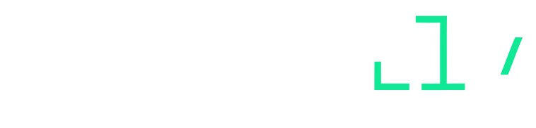

[](LICENSE)
[](https://modelcontextprotocol.io)
[](.github/workflows/sync-threats.yml)
[](packages/mvp-catalog/src/stack-registry.ts)
[](pipeline/scripts/lib/sources)

> **🆕 Catalog doubles to 12 stacks.** Django, Rails, Go, iOS, and Android graduate to launch — alongside a brand-new **AI / LLM Apps** stack covering LangChain, LlamaIndex, Hugging Face transformers, vLLM, and Ollama.
> **Plus EPSS exploit-probability scoring on every CVE.** [Read the launch post →](./PRESS_RELEASE.md)

The open-source CVE catalog, pipeline, and MCP server behind [aigent.ly](https://aigent.ly). Every day, CI ingests fresh CVEs from six public threat sources, enriches them with AI-generated coding patterns, and commits ready-to-use security rules directly into this repo — formatted for Cursor, Claude Code, Windsurf, GitHub Copilot, and Cline.

**12 stacks · 6 sources · daily CI · MCP-native · Apache 2.0 · 0 keys required to consume.**

---

## How it works

<video src="brand/aigently-mcp-demo.mp4" controls width="100%"></video>

```text
CVE published  →  pipeline detects it  →  Claude generates safe-code patterns
    →  rule committed to this repo  →  your IDE enforces it while you type
```

AI coding assistants write production code fast. They don't know which CVEs landed last week, or how to write around them. Aigent.ly bridges that gap: it turns a live CVE feed into IDE rules that travel with your project, **enforced at generation time — not discovered at audit time**.

### Why it exists

- AI assistants don't know which CVEs landed last week.
- SAST catches issues at audit time. Aigent.ly catches them at **generation time**.
- Free, open data. Private, paid product. The security boundary is by design.

---

## Quick start

No API keys needed to consume. CI commits fresh snapshots daily — point your IDE at the MCP server and you're done.

### Use via MCP (recommended)

Add to your IDE's MCP config — works with Claude Code, Cursor, Windsurf, Copilot, and Cline:

```json
{
  "mcpServers": {
    "aigently": {
      "command": "npx",
      "args": ["-y", "@aigently/mcp-server@latest"]
    }
  }
}
```

The MCP server reads static JSON from `packages/catalog-data/` — **no database, no API keys, no setup**.

### Available MCP tools

| Tool | Description | Returns EPSS? |
| --- | --- | :---: |
| `get_security_context` | Detect your stack and return relevant rules and top CVEs | ✅ |
| `compose_guardrail` | Generate an IDE-ready rules file for your stack | – |
| `search_threats` | Full-text and faceted CVE search; ranks by KEV → severity → EPSS | ✅ |
| `get_threat` | Full CVE detail with AI-generated safe-code patterns | ✅ |
| `detect_project_stack` | Identify stack(s) from a file list | – |
| `list_stacks` | Enumerate all 12 supported stacks | – |
| `get_manifest` | Catalog version + counts | – |

---

## 🛡 What's covered

### Stacks (12)

| # | Stack | Ecosystem | Family | Status |
| --- | --- | --- | --- | --- |
| 1 | Next.js | npm | owasp_web | live |
| 2 | Express / Node.js | npm | owasp_web | live |
| 3 | FastAPI / Python | PyPI | owasp_web | live |
| 4 | NestJS | npm | owasp_web | live |
| 5 | Nuxt | npm | owasp_web | live |
| 6 | React SPA | npm | owasp_web | live |
| 7 | Django | PyPI | owasp_web | **🆕 NOW LIVE** |
| 8 | Ruby on Rails | RubyGems | owasp_web | **🆕 NOW LIVE** |
| 9 | Go | Go | owasp_web | **🆕 NOW LIVE** |
| 10 | iOS / Swift | SwiftURL | owasp_web | **🆕 NOW LIVE** |
| 11 | Android / Kotlin | Maven | owasp_web | **🆕 NOW LIVE** |
| 12 | **AI / LLM Apps** | PyPI | **owasp_llm** | **✨ NEW** |

**To add a stack:** open [`packages/mvp-catalog/src/stack-registry.ts`](packages/mvp-catalog/src/stack-registry.ts), add a `StackConfig` entry (set `family: "owasp_llm"` for AI-application stacks; default is `owasp_web`), and open a PR.

### Sources (6)

| Source | Role | Auth | Rate limit (free) |
| --- | --- | --- | --- |
| **NVD** (NIST) | Authoritative CVE registry. Backfills CVSS scores and CWE IDs. | Optional API key | 5 req/30s (50 with key) |
| **CISA KEV** | Actively-exploited CVEs. Sets `isActivelyExploited` as the hard prioritization signal. | None | Static feed |
| **GHSA** (GitHub) | Advisories across npm, PyPI, RubyGems, Maven, Go, Swift. | `Bearer` token | 5,000 req/hr |
| **OSV** (Google) | Per-package vulnerabilities, scoped to packages your stacks declare. | None | No published limit |
| **npm Audit** | Direct package advisory scan per stack. Catches advisories not yet in OSV/GHSA. | None | No published limit |
| **EPSS** (FIRST.org) | **🆕** Daily-updated exploit-probability score (0–1) per CVE. | None | 1,000 req/min |

---

## 🚦 How threats are prioritized

Every threat in the catalog carries multiple ranking signals so the MCP layer can surface the CVEs that actually matter:

```text
final_rank =  isActivelyExploited (CISA KEV)        ← ground truth: it's being exploited NOW
           +  severity (CVSS bucket)                 ← classic theoretical severity
           +  epssScore ≥ 0.5  (+1) / ≥ 0.9 (+2)    ← prediction: how likely 30-day exploitation
           +  family match (owasp_web | owasp_llm)   ← keep LLM threats from polluting web rankings
           +  intent overlap (auth/inject/csrf/rag)  ← what the developer is actually doing
```

EPSS is the difference between "CVSS 9.8 — patch in the next sprint" and "CVSS 9.8 with EPSS 0.94 — drop everything." We expose both.

---

## 🧠 AI / LLM stack

The `ai-llm` stack ingests CVEs against the AI application toolchain and classifies them against the **OWASP LLM Top 10** instead of the Web Top 10:

**Watched packages:** `langchain`, `langchain-community`, `langchain-core`, `llama-index`, `llama-index-core`, `llama-cpp-python`, `transformers`, `huggingface_hub`, `vllm`, `gradio`, `ollama`, `anthropic`, `openai`, `pydantic-ai`, `crewai`, `autogen-agentchat`, `dspy-ai`.

**OWASP LLM mapping** (excerpt — see [`pipeline/scripts/lib/normalise.ts`](pipeline/scripts/lib/normalise.ts)):

| OWASP LLM | Common CWEs | Example |
| --- | --- | --- |
| LLM01 — Prompt Injection | CWE-20 / 77 / 78 / 94 / 1321 | Untrusted retrieval context concatenated into the system prompt |
| LLM02 — Insecure Output / SSRF | CWE-200 / 918 | Tool-calling agent fetches arbitrary internal URLs from a crafted prompt |
| LLM05 — Supply Chain | CWE-116 / 502 | Untrusted model checkpoint deserialization |
| LLM06 — Sensitive Info / Authz | CWE-284 / 285 | Embeddings store leaks training-data secrets |

Threats from this stack flow through a dedicated LLM-aware prompt in `amplify-threats.ts` so guardrails are framed in LLM vocabulary (`NEVER concatenate retrieved context into the system prompt without delimiters`) rather than web vocabulary.

---

## Threat intelligence pipeline

### Pipeline stages

```text
Daily CI run (GitHub Actions, 06:00 UTC)

  Phase 0     CISA KEV map + stack registry preflight
  Phase 1–3   npm Audit + OSV + GHSA → raw advisories
  Phase 5     deduplicate (source-priority based)
  Phase 4a    EPSS exploit-probability enrichment    ← NEW (batched, 50 CVEs/req)
  Phase 4     NVD: backfill CVSS & CWE for low-confidence rows
  Phase 6–8   upsert threats + per-stack mapping + mitigation flags
  Phase 9     close sync log

  Amplify     Claude: 2–4 ALWAYS/NEVER patterns per CVE (family-aware prompt)
  Summarize   Claude: cluster CVEs into per-stack rule docs
  Synthesize  Claude: merge into pre-built guardrail blocks (patterns + deps)
  Export      write JSON snapshots to packages/catalog-data/
  Commit      auto-push catalog-data/ to this repo
```

<details>
<summary><strong>Repository layout</strong></summary>

| Path | Contents |
| --- | --- |
| [`packages/catalog-data/`](packages/catalog-data/) | Live threat snapshots — JSON committed daily by CI |
| [`packages/mcp-server/`](packages/mcp-server/) | MCP server (`@aigently/mcp-server`) — exposes catalog to AI agents |
| [`packages/db/`](packages/db/) | Drizzle schema shared between the pipeline and the web app |
| [`packages/mvp-catalog/`](packages/mvp-catalog/) | Stack registry — add a stack entry here to onboard it |
| [`packages/api-client/`](packages/api-client/) | TypeScript client generated from the OpenAPI spec |
| [`pipeline/scripts/`](pipeline/scripts/) | `sync`, `amplify`, `summarize`, `synthesize`, `export` — the full pipeline |
| [`pipeline/scripts/lib/sources/`](pipeline/scripts/lib/sources/) | One file per data source (NVD, OSV, GHSA, npm-audit, CISA KEV, EPSS) |
| [`.github/workflows/sync-threats.yml`](.github/workflows/sync-threats.yml) | Daily CI: ingest CVEs → AI guardrails → commit |

</details>

---

## Run the pipeline locally

```bash
git clone https://github.com/aelbuni/aigently-catalog
cd aigently-catalog
npm install

cp pipeline/.env.example pipeline/.env   # default DATABASE_URL matches docker-compose
npm run db:setup                         # start Postgres, migrate, seed
```

```bash
# pipeline/.env — keys you need only when running the pipeline yourself:
ANTHROPIC_API_KEY=...   # required for amplify, summarize, synthesize
GITHUB_TOKEN=...        # required for GHSA source
NVD_API_KEY=...         # optional — increases NVD rate limit 10×
# EPSS requires no key.

npm run sync:threats           # ingest CVEs from all six sources
npm run amplify:threats        # Claude: ALWAYS/NEVER patterns per CVE (family-aware)
npm run summarize:rules        # Claude: cluster into per-stack rule docs
npm run synthesize:guardrails  # Claude: pre-build guardrail blocks
npm run export:catalog         # write JSON to packages/catalog-data/
```

<details>
<summary><strong>All scripts & environment variables</strong></summary>

### Scripts

| Script | Purpose |
| --- | --- |
| `npm run db:up` | Start Postgres via Docker Compose |
| `npm run db:setup` | First-time setup: start Postgres + migrate + seed |
| `npm run db:migrate` | Apply Drizzle migrations |
| `npm run db:seed` | Full catalog seed |
| `npm run db:seed:upsert` | Non-destructive upsert |
| `npm run sync:threats` | Ingest CVEs from all six sources |
| `npm run amplify:threats` | AI-generate patterns for new threats |
| `npm run summarize:rules` | AI-cluster CVEs into rule summaries |
| `npm run synthesize:guardrails` | Pre-build per-stack guardrail blocks |
| `npm run export:catalog` | Export DB → `packages/catalog-data/` JSON |

### Environment variables

| Variable | Required | Purpose |
| --- | --- | --- |
| `DATABASE_URL` | Always | Postgres connection string |
| `ANTHROPIC_API_KEY` | AI steps | Claude API access |
| `GITHUB_TOKEN` | Sync | GitHub advisory source (GHSA) |
| `NVD_API_KEY` | Optional | 10× NVD rate limit |
| `STACK_FILTER` | Optional | Limit a sync run to one stack slug (e.g. `ai-llm`) |
| `DRY_RUN` | Optional | Enrich + dedup without writing to DB |

### Prerequisites

- Node.js 22+
- Docker (for local Postgres)
- Anthropic API key (AI pipeline steps only)

</details>

---

## 🗺 Roadmap

Already shipped: 12 stacks · 6 sources · EPSS-ranked prioritization · family-aware (web + LLM) amplifier prompts.

Next on deck (PRs welcome):

- **PoC / exploit-availability detection** — GitHub + Exploit-DB + Nuclei templates
- **Vendor advisories** — MSRC + Red Hat + Ubuntu (for base-image / OS-level CVEs)
- **STIX 2.1 export** — for SIEM ingestion
- **KEV / EPSS watchlist webhooks** — alert when a CVE in your detected stack moves into KEV or above an EPSS threshold
- **Spring Boot, Laravel, .NET stacks** — open to contribution

---

## Contributing

PRs are welcome. The highest-value contributions are:

- **New stacks** — add to [`packages/mvp-catalog/src/stack-registry.ts`](packages/mvp-catalog/src/stack-registry.ts) (set `family: "owasp_llm"` for AI/LLM stacks)
- **CVE curation** — improve `mustLines`, `ruleContext`, or `alwaysPin` in [`packages/catalog-data/seed-master.json`](packages/catalog-data/seed-master.json)
- **Pattern quality** — open an issue if an `ALWAYS`/`NEVER` line is wrong or too generic
- **New threat sources** — add a module under [`pipeline/scripts/lib/sources/`](pipeline/scripts/lib/sources/)

See [`CONTRIBUTING.md`](CONTRIBUTING.md) for full guidelines.

---

## License

Apache 2.0 — threat data sourced from public domain (NVD, CISA KEV, GHSA, OSV, EPSS).

> *"We open-sourced everything the community needs — the data, the pipeline, the stack registry. The web app that runs aigent.ly is private. Because a security product should practice what it preaches."*

Aigent.ly and the Aigent.ly logo are trademarks of Aigently, Inc.
